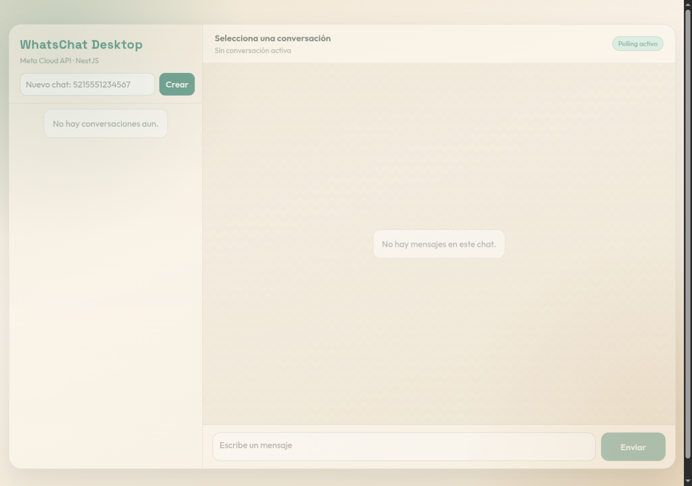

# WhatsApp Desktop-style chat with NestJS + Meta Cloud API

WhatsChat is a local MVP that combines a WhatsApp Desktop-style single-page interface with a NestJS API, Prisma persistence, and Meta WhatsApp Cloud API integration.

> **MVP boundary:** it is a development demo, not a production-ready WhatsApp client. Authentication and Meta webhook signature validation are not implemented.

## Interface



## Quick start

1. Create local configuration and fill in your Meta values:

   ```bash
   cp .env.example .env
   ```

2. Install dependencies and synchronize the local SQLite schema:

   ```bash
   npm ci
   npx prisma db push
   ```

3. Start the development server and open [http://localhost:3000](http://localhost:3000):

   ```bash
   npm run start:dev
   ```

<details>
<summary><strong>Run the compiled build</strong></summary>

```bash
npm run build
npm start
```

</details>

## Features

- [x] Conversation list and message history
- [x] Create or open a chat from a WhatsApp number
- [x] Send outbound text messages through Meta Cloud API
- [x] Receive inbound messages and delivery-status updates through webhooks
- [x] Persist contacts, conversations, and messages in local SQLite
- [x] Poll the local API to refresh the SPA
- [x] Check service availability at `GET /api/health`

## Tech stack

| Layer | Choice |
| --- | --- |
| Backend | NestJS 10 + TypeScript |
| Data | Prisma ORM + SQLite |
| WhatsApp integration | Meta WhatsApp Cloud API via Axios |
| Frontend | Static HTML/CSS/JavaScript SPA served by NestJS |
| Validation | Joi configuration schema and Nest `ValidationPipe` |

## Architecture

| Area | Responsibility |
| --- | --- |
| `src/chat/` | Conversation API, message lifecycle, and persistence coordination |
| `src/whatsapp/` | Outbound calls to Meta Graph API using environment configuration |
| `src/webhook/` | Meta challenge verification plus inbound-message and status processing |
| `src/prisma/` | Shared Prisma client lifecycle |
| `public/` | Browser SPA, rendered from the application root |

### Prisma schema overview

| Model | Purpose | Key relationships |
| --- | --- | --- |
| `Contact` | WhatsApp identity (`waId`) and optional display name | One optional `Conversation`; many `Message` records |
| `Conversation` | One chat per contact | Owns many `Message` records; cascades on contact deletion |
| `Message` | Direction, content, type, status, Meta ID, and timestamps | Belongs to one contact and one conversation |

`Message` is indexed by `(conversationId, createdAt)` for chronological chat reads and by `contactId` for contact lookup.

<details>
<summary><strong>API map</strong></summary>

| Endpoint | Use |
| --- | --- |
| `GET /api/health` | Health check |
| `GET /api/chat/conversations` | List conversations |
| `POST /api/chat/conversations` | Create or open a conversation |
| `GET /api/chat/conversations/:id/messages` | Read message history |
| `POST /api/chat/send` | Queue and send a text message |
| `GET /webhook` / `POST /webhook` | Meta webhook verification and event receiver |

</details>

## Environment and limits

- Keep `.env` local. It contains `DATABASE_URL`, `WHATSAPP_TOKEN`, `WHATSAPP_PHONE_NUMBER_ID`, `WHATSAPP_VERIFY_TOKEN`, and optional `WHATSAPP_API_VERSION`.
- Free-form text delivery is constrained by WhatsApp's 24-hour customer-service window; rejected sends are stored as `FAILED`.
- Before production, add application authentication and validation of Meta's `X-Hub-Signature-256` header.
- For local Meta webhook testing, expose `/webhook` through a public HTTPS tunnel and use the same verify token in Meta and `.env`.
